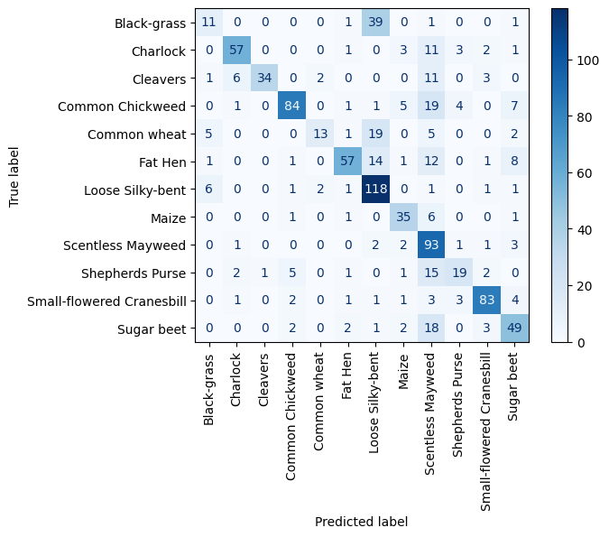
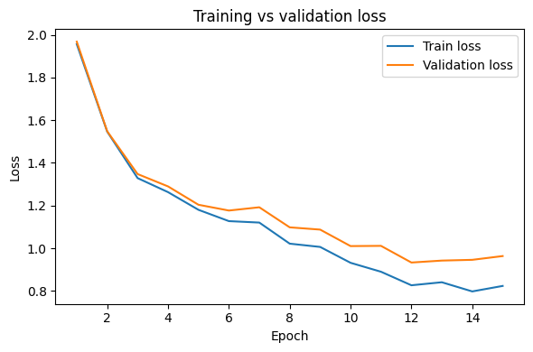

# cnn-plant-classifier
# 🌿 Plant Species Image Classification using CNN

## Overview
Built a convolutional neural network (CNN) to classify images of plants into 30 different species using deep learning techniques. The project demonstrates end-to-end workflow including data preprocessing, model training, evaluation, and performance analysis.

---

## Problem
Accurately identifying plant species from images can be challenging and time-consuming. This project explores how computer vision and deep learning can automate plant classification to support applications in environmental science, agriculture, and biodiversity research.

---

## Solution
A convolutional neural network (CNN) was developed to learn visual patterns from plant images and classify them into 30 distinct species. The model was trained and evaluated using labeled image data, with performance assessed through multiple evaluation metrics.

---

## Tools & Technologies
- Python
- PyTorch
- NumPy
- Matplotlib
- Jupyter Notebook

---

## Process
- Preprocessed and organized image dataset
- Built and trained a CNN architecture
- Evaluated model performance using validation data
- Generated visual metrics including training curves and confusion matrix
- Analyzed prediction results and model accuracy

---

## Results
- Successfully classified plant images into 30 species
- Achieved strong model performance through training and tuning
- Evaluated results using:
  - Accuracy and loss curves
  - Confusion matrix
  - Visual prediction outputs

---

## Visual Outputs

### Confusion Matrix

### Training Results

---

## Project Structure
cnn-plant-classifier/
│
├── README.md
├── notebook.ipynb
├── images/
│ ├── confusion-matrix.png
│ ├── training-results.png
│ └── sample-predictions.png

---

## Future Improvements
- Improve model accuracy with additional data augmentation
- Experiment with deeper architectures (ResNet, EfficientNet)
- Deploy model as an API for real-time predictions

---

## Author
Peyton Bailey  
Data Science Graduate Student  
